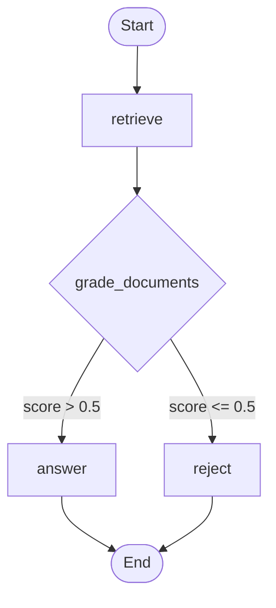

# Legixo Legal RAG Pipeline with LangGraph

This repository contains an end-to-end Retrieval-Augmented Generation (RAG) system with a LangGraph state machine designed to query legal documents from the Legixo sample corpus.

---

## Architecture & Graph Flow

The pipeline is modeled as a StateGraph with the following nodes and logic:



### LangGraph Loop Safety
This graph contains no cyclic edges. Therefore, execution is guaranteed to terminate after at most:
* `retrieve` → `answer`
* `retrieve` → `reject`

---

## Setup Instructions

### 1. Installation
Clone the repository and install the dependencies listed in `requirements.txt`:
```bash
pip install -r requirements.txt
```

### 2. Environment Variables
Create a `.env` file in the root directory and configure the following credentials:
```ini
PINECONE_API_KEY=your-pinecone-api-key
PINECONE_INDEX=legal-rag
GROQ_API_KEY=your-groq-api-key
```

---

## Running the Pipeline

### Step 1: Ingest and Embed Documents
Run the ingestion script to parse, chunk (using `RecursiveCharacterTextSplitter`), embed (using `sentence-transformers/all-MiniLM-L6-v2`), and upsert documents to Pinecone:
```bash
python app/ingest.py
```
*Note: The ingest script has built-in self-healing path resolution and will automatically detect and recreate the Pinecone index if there is a vector dimension mismatch.*

### Step 2: Test the Pipeline Flow
Run the test pipeline script to run a simple end-to-end retrieve-and-generation test (without LangGraph):
```bash
python test_pipeline.py
```

### Step 3: Test the LangGraph Workflow
Run the graph test script to execute the full LangGraph state machine with automatic fallback routing for invalid questions:
```bash
python test_graph.py
```

### Step 4: Start the API Server
Start the FastAPI server hosting the RAG pipeline endpoint:
```bash
python app/main.py
```
This runs the web server locally at `http://localhost:8000`.

---

## API Documentation & Usage

The API exposes a POST `/query` endpoint mapping to the LangGraph pipeline execution.

### Example Request (`curl`)
```bash
curl -X POST http://localhost:8000/query \
     -H "Content-Type: application/json" \
     -d '{"question": "When is the hearing scheduled?"}'
```

### Example Response (Success)
```json
{
  "answer": "The hearing is scheduled for 15 August 2025, at 11:00 a.m.",
  "citations": [
    {
      "source_file": "testcases.md"
    },
    {
      "source_file": "03_hearing_notice_template.md"
    },
    {
      "source_file": "05_counsel_notes_settlement.md"
    },
    {
      "source_file": "01_matter_memo_arvind_v_northfield.md"
    },
    {
      "source_file": "04_statute_style_excerpt_fictional.md"
    }
  ]
}
```

### Example Request (Out of bounds)
```bash
curl -X POST http://localhost:8000/query \
     -H "Content-Type: application/json" \
     -d '{"question": "Who is the president of India?"}'
```

### Example Response (Rejection / Fallback)
```json
{
  "answer": "I could not find the answer in the provided documents.",
  "citations": []
}
```

### Postman Steps
1. Set HTTP request method to **POST**.
2. Enter URL: `http://localhost:8000/query`.
3. Under the **Headers** tab, add key `Content-Type` with value `application/json`.
4. Under the **Body** tab, select **raw** and set the format to **JSON**.
5. Input the request body:
   ```json
   {
       "question": "When is the hearing scheduled?"
   }
   ```
6. Click **Send** to see the structured JSON output.

---

## Architectural Mapping
A detailed specification of the LangGraph workflow, nodes, and routing logic is documented in [docs/langgraph.md](file:///c:/Users/HP/Documents/gen_ai_takehome_sample_corpus/docs/langgraph.md).
